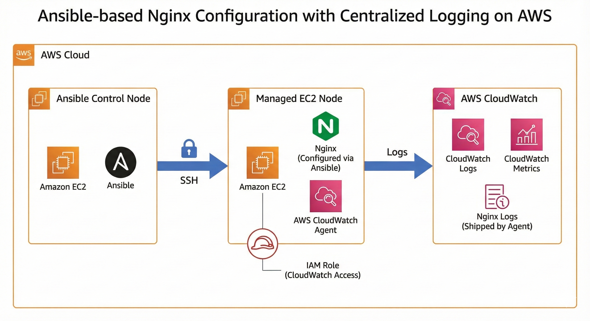

# Configuration Management with Ansible and Centralized Logging on AWS

## Project Overview
This project demonstrates the use of Ansible for configuration management to automate the installation and configuration of Nginx on an AWS EC2 instance, along with centralized log shipping to AWS CloudWatch Logs for monitoring and observability.

The solution focuses on automation, consistency, and visibility by eliminating manual server configuration and enabling centralized log management using AWS-native services.

---

## Architecture Diagram

---

## Architecture Components
- Ansible Control Node (EC2 instance)
- Managed EC2 Node running Nginx
- SSH-based communication between control and managed nodes
- AWS CloudWatch Agent for log shipping
- IAM Role attached to the managed EC2 instance for CloudWatch access
- AWS CloudWatch Logs for centralized logging

---

## Tools and Technologies Used
- Ansible
- AWS EC2
- AWS CloudWatch
- CloudWatch Agent
- Nginx
- Linux (Amazon Linux)

---

## Implementation Steps
1. Created an Ansible user on the managed EC2 instance using user-data.
2. Configured passwordless SSH access between the Ansible control node and the managed node.
3. Wrote and executed an Ansible playbook to:
   - Install and configure Nginx
   - Install and configure the CloudWatch Agent
4. Attached an IAM role to the managed EC2 instance with permissions to publish logs to CloudWatch.
5. Verified Nginx access and error logs in AWS CloudWatch Logs.

---

## Outcome
- Automated and consistent Nginx deployment using Ansible.
- Centralized log management with AWS CloudWatch.
- Reduced manual configuration and operational overhead.
- Improved monitoring and observability of application logs.

